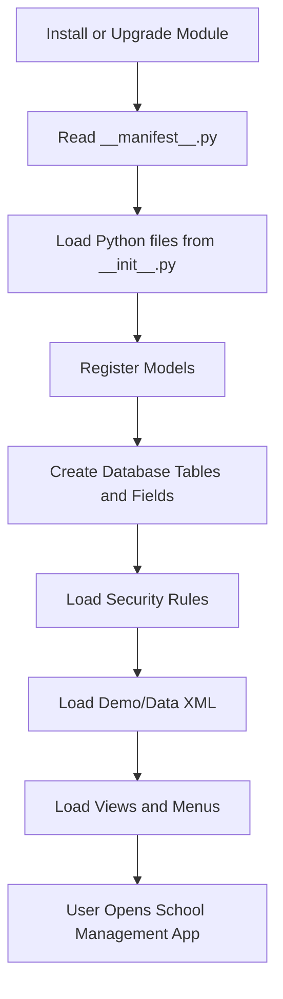
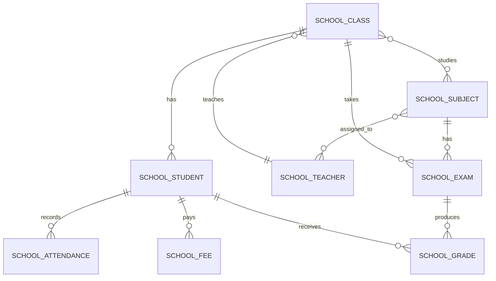
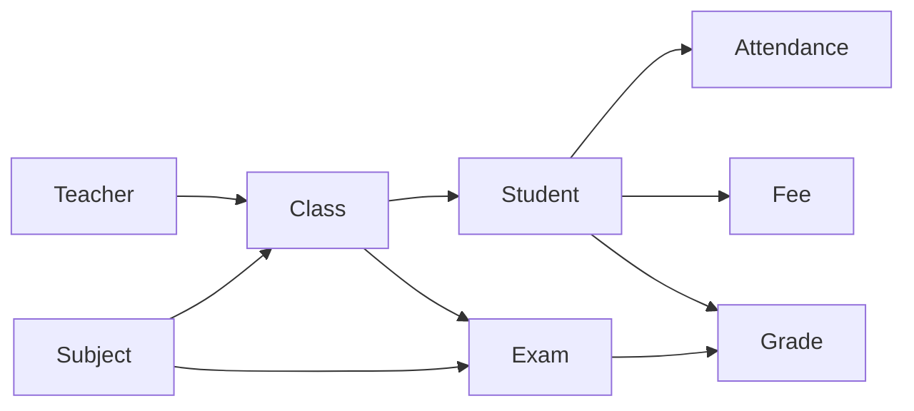
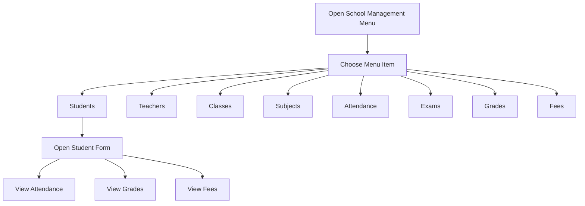
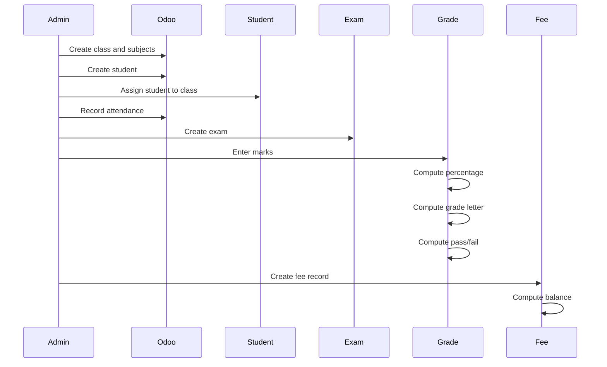

# School Management Project Structure

This module is an Odoo application for managing a school. It stores students,
teachers, classes, subjects, attendance, exams, grades, and fees.

## 1. Folder Structure

```text
custom/school_management/
├── __manifest__.py
├── __init__.py
├── models/
│   ├── __init__.py
│   ├── student.py
│   ├── teacher.py
│   ├── school_class.py
│   ├── subject.py
│   ├── attendance.py
│   ├── exam.py
│   ├── grade.py
│   └── fee.py
├── views/
│   ├── menu.xml
│   ├── student_views.xml
│   ├── teacher_views.xml
│   ├── class_views.xml
│   ├── subject_views.xml
│   ├── attendance_views.xml
│   ├── exam_views.xml
│   ├── grade_views.xml
│   └── fee_views.xml
├── security/
│   ├── school_security.xml
│   └── ir.model.access.csv
└── data/
    └── demo_data.xml
```

## 2. What Each Part Does

| File or Folder | What it is | Why we need it |
| --- | --- | --- |
| `__manifest__.py` | Module information file | Tells Odoo the module name, dependencies, and which XML files to load |
| `__init__.py` | Python loader | Imports the `models` folder so Odoo can register your models |
| `models/` | Python business logic | Defines database tables, fields, relationships, computed fields, and actions |
| `views/` | XML user interface | Defines list, form, kanban, search views, menus, and actions |
| `security/` | Access control | Defines who can see, create, edit, or delete records |
| `data/demo_data.xml` | Sample records | Creates example students, teachers, subjects, and classes for testing |

## 3. Module Loading Workflow



## 4. Main Data Relationship Diagram



## 5. Model Workflow



## 6. Important Models

### Student

File: `models/student.py`

This model stores student information such as name, student ID, gender, date of
birth, class, parent contact, photo, attendance, grades, and fees.

Important functions:

| Function | What it does |
| --- | --- |
| `_compute_age` | Calculates student age from date of birth |
| `open_attendance` | Opens attendance records for the selected student |
| `open_grades` | Opens grade records for the selected student |
| `open_fees` | Opens fee records for the selected student |

Why we need it: students are the center of the system. Attendance, grades, and
fees all connect back to students.

### Class

File: `models/school_class.py`

This model stores class information such as class name, section, teacher,
subjects, students, capacity, and room.

Important functions:

| Function | What it does |
| --- | --- |
| `_compute_student_count` | Counts how many students are in the class |
| `_compute_capacity_progress` | Calculates class capacity percentage |

Why we need it: it groups students and connects them with teachers and subjects.

### Teacher

File: `models/teacher.py`

This model stores teacher information such as employee ID, email, phone, gender,
subjects, assigned classes, and photo.

Why we need it: teachers are assigned to classes and subjects.

### Subject

File: `models/subject.py`

This model stores subject information such as subject name, code, description,
and assigned teachers.

Why we need it: subjects are used by classes and exams.

### Attendance

File: `models/attendance.py`

This model records whether a student is present, absent, late, or excused on a
specific date.

Important rule:

```text
One student can only have one attendance record per date.
```

Why we need it: it prevents duplicate attendance for the same student on the
same day.

### Exam

File: `models/exam.py`

This model stores exam information such as exam name, subject, class, exam type,
date, total marks, and passing marks.

Why we need it: grades depend on exams.

### Grade

File: `models/grade.py`

This model stores student marks for an exam. It automatically calculates
percentage, grade letter, and pass/fail result.

Important functions:

| Function | What it does |
| --- | --- |
| `_compute_percentage` | Calculates percentage from marks obtained and total marks |
| `_compute_grade` | Converts percentage into grade letter |
| `_compute_result` | Checks if the student passed or failed |

Why we need it: it turns raw exam marks into useful academic results.

### Fee

File: `models/fee.py`

This model stores student fee records such as fee type, amount, due date, paid
amount, status, payment method, receipt number, and balance.

Important functions:

| Function | What it does |
| --- | --- |
| `_compute_balance` | Calculates remaining balance |
| `action_mark_paid` | Marks the fee as paid and fills paid amount/date |

Why we need it: it tracks student payments and unpaid balances.

## 7. User Interface Workflow



## 8. Example Business Workflow



## 9. Why We Use Odoo Structure

Odoo separates a module into Python models, XML views, security rules, and data
files. This makes the system easier to maintain.

| Part | Reason |
| --- | --- |
| Models | Store data and business logic |
| Views | Show data to users |
| Security | Protect data from unauthorized users |
| Data XML | Add default or sample records |
| Manifest | Control module installation order |

## 10. Simple Summary

This project works like this:

```text
Teacher teaches Class
Class contains Students
Subject belongs to Classes and Exams
Student has Attendance
Student has Fees
Student takes Exams
Exam creates Grades
Grade calculates percentage, letter, and result
Fee calculates remaining balance
```

