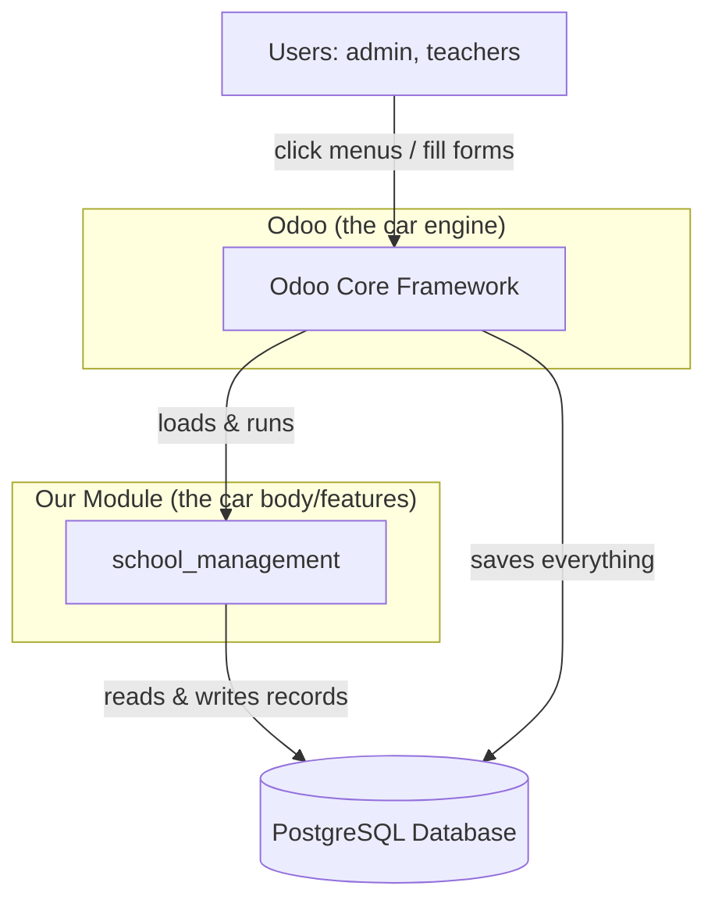
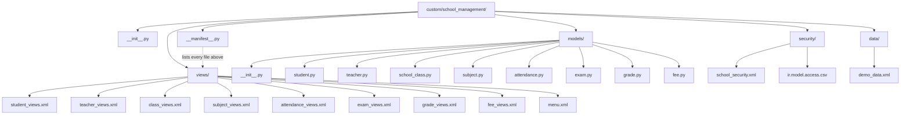
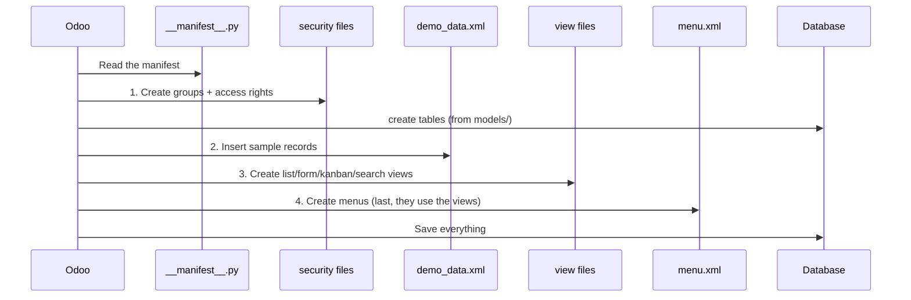
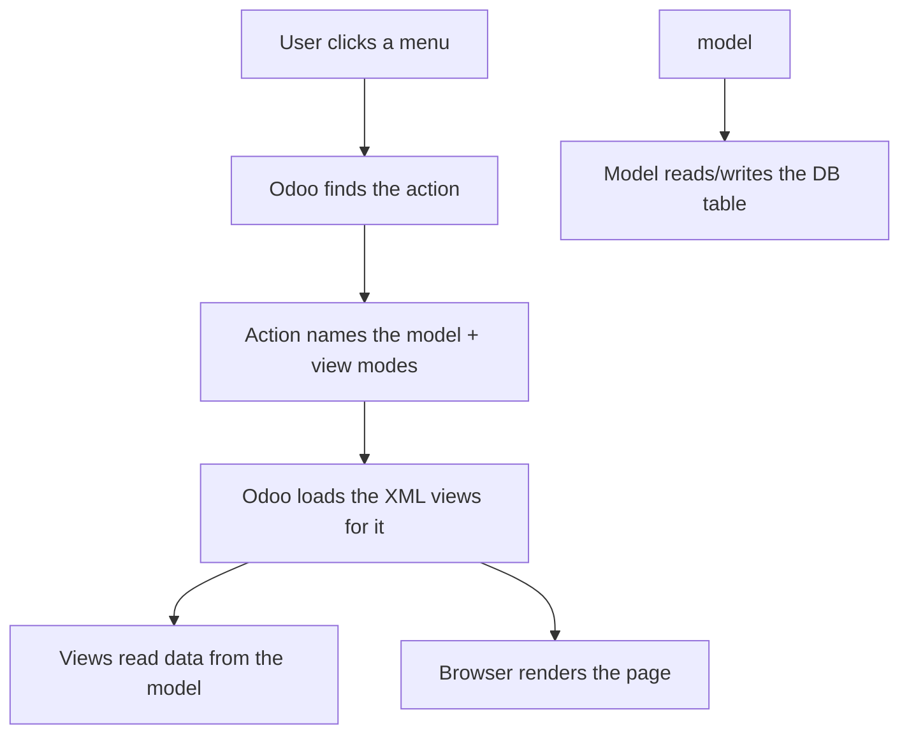
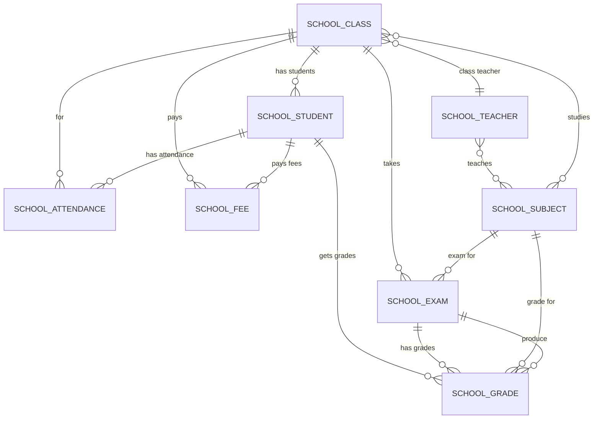
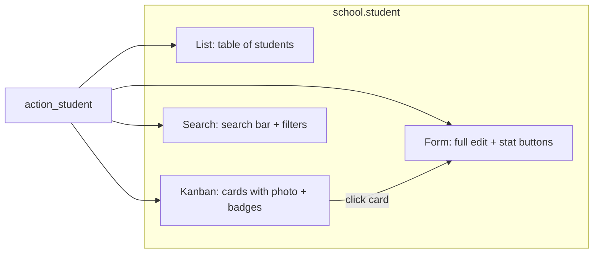
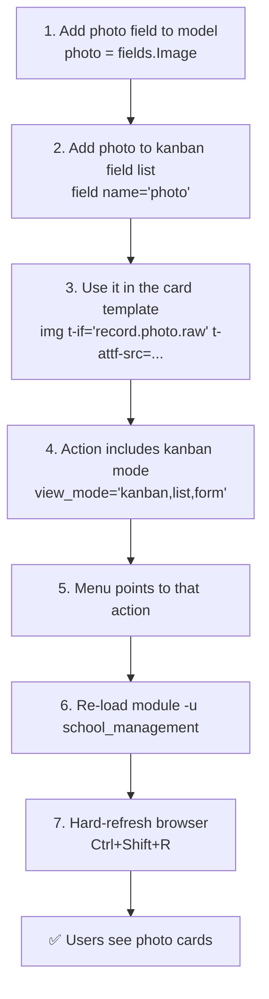

# School Management — Diagrams, Structure & Workflow

A visual + plain-English guide to **what's in the project, how it works,
what each piece is, and why we need it.**

> Great for self-study. Every diagram below is written in **Mermaid**, which
> GitHub (and many Markdown viewers) render as a picture automatically.

---

## Table of Contents

1. [The Big Picture — What is this project?](#1-the-big-picture)
2. [Project Folder Tree](#2-project-folder-tree)
3. [Module Load Pipeline (what happens at install)](#3-module-load-pipeline)
4. [Data Flow — Model → View → Menu → Screen](#4-data-flow)
5. [Model Relationships (the school's data map)](#5-model-relationships)
6. ["What is it & Why do we need it" — Cheat Table](#6-what-is-it--why)
7. [How the UI Parts Work Together](#7-how-the-ui-parts-work-together)
8. [The Fix We Just Made (kanban `card`)](#8-the-kanban-card-fix)
9. [Lifecycle: A Feature From Idea to Screen](#9-lifecycle)

---

## 1. The Big Picture

This is an **Odoo module** that turns a generic Odoo install into a **School
Management System**. A "module" is just a folder of code that adds features.
Odoo itself is the engine; modules are the features.



**Why a module?**
- Keeps our code separate from the core (so we don't break Odoo).
- Easy to install/uninstall/share.
- Odoo handles security, menus, forms, database — we just describe what we want.

---

## 2. Project Folder Tree



| Folder | What it holds | Why we need it |
|--------|--------------|----------------|
| `__manifest__.py` | The module's ID card + file list | Odoo reads this first to know what to load. |
| `models/` | Python classes = database tables | Defines *what data* we store. |
| `security/` | Groups + access rules | Controls who can see/edit what. |
| `data/` | Sample "demo" records | Pre-fills example data so the UI isn't empty. |
| `views/` | XML = the user interface | Defines *how* data is shown/edited. |

---

## 3. Module Load Pipeline

When you install or upgrade, Odoo follows the `data` list **in order**:



**Why this order matters:** Menus point to "actions" defined inside view files,
so views must load **before** menus. Security must load before data so access
rules exist first.

---

## 4. Data Flow

How a click becomes a screen:

```mermaid
flowchart LR
    M[<b>menu.xml</b><br/>School → Students → All Students] --> A[<b>action_student</b><br/>ir.actions.act_window<br/>"show school.student as kanban,list,form"]
    A --> V[<b>view files</b><br/>kanban + list + form + search]
    A --> MO[<b>model</b><br/>school.student (Python)]
    MO --> F[<b>fields</b><br/>name, class_id, photo...]
    F --> DB[(Database table<br/>school_student)]
    V --> SCREEN[User sees the page]
    DB --> V
```



**Simple version:** Menu → Action → Views → Model → Database → back to screen.

---

## 5. Model Relationships

Here is how the 8 models connect (the "data map" of the school):



**In plain words:**
- A **Class** has many **Students**, one **Teacher**, many **Subjects**.
- A **Student** belongs to one **Class**, has many **Attendances**, **Grades**, **Fees**.
- A **Teacher** teaches many **Subjects** and is the teacher of many Classes.
- An **Exam** belongs to a **Subject** + **Class** and produces many **Grades**.
- A **Grade** links a Student + Exam + Subject.

| Relation type | Odoo field | Example |
|---------------|-----------|---------|
| One-to-many (one class → many students) | `One2many` / `Many2one` | `class_id` on student |
| Many-to-many (teacher ↔ subject) | `Many2many` | `subject_ids` on teacher |

---

## 6. "What is it & Why"

| Part | What it is | Why we need it |
|------|-----------|----------------|
| **Model** (`models/*.py`) | A Python class that becomes a DB table | The "shape" of our data; without it there's nothing to store. |
| **Field** (`fields.Char`, `fields.Many2one`...) | A column of the table | Defines one piece of info (name, date, amount...). |
| **Computed field** | A column calculated from other fields | e.g. `age`, `percentage`, `capacity_progress` — no one types them. |
| **Relation field** | `Many2one`/`One2many`/`Many2many` | Connects records (student→class, teacher→subject). |
| **View** (`views/*.xml`) | XML describing a screen | Tells Odoo how to *display* the data. |
| **List view** | A table of rows | Quick scan/edit many records. |
| **Form view** | One record, full detail | Create/edit a single record. |
| **Kanban view** | Cards (like a board) | Nice visual browsing of records/photos. |
| **Search view** | Search bar + filters | Find records fast. |
| **Action** (`ir.actions.act_window`) | A "go here and show this" bundle | Fasoules model + view modes into one clickable target for menus. |
| **Menu** (`views/menu.xml`) | Navigation item | Lets users *find* the feature. |
| **Security group** | A named role | e.g. "School Administrator" — controls access. |
| **Access rule (CSV)** | Permissions (read/write/create/delete) | Stops people seeing/editing what they shouldn't. |
| **Demo data** (`data/demo_data.xml`) | Sample records | Fills the UI so you can see it working. |

---

## 7. How the UI Parts Work Together



Every model typically gets 4 views + 1 action. The action decides the order
(`kanban,list,form`). Menus point to the action.

---

## 8. The Kanban Card Fix

Remember the `Missing 'card' template` error? Here's the visual:

```mermaid
flowchart TD
    BAD["<b>WRONG</b> (older Odoo guides)<br/><t t-name='kanban-box'>"] --> P[KanbanArchParser<br/>looks for templateDocs['card']]
    P --> MISSING["templateDocs['card'] = undefined"]
    MISSING --> ERROR["🚨 Error: Missing 'card' template."]

    GOOD["<b>CORRECT</b> (Odoo 19)<br/><t t-name='card'>"] --> P2[KanbanArchParser<br/>finds templateDocs['card']]
    P2 --> WORKS["✅ Card renders"]
```

**Rule:** On this Odoo version, the card template **must** be named
`t-name="card"` (not `kanban-box`). Every field used inside the template must
also be listed at the top of `<kanban>`.

---

## 9. Lifecycle: A Feature From Idea to Screen

Let's trace one feature — **"view student photos in cards"**:



**The golden rule:** to see any change you need ALL of
(1) edit model, (2) edit view, (3) reload module, (4) refresh browser.

---

## Quick Recap

- **Model** = what data we store (Python).
- **View** = how we show it (XML).
- **Action** = bundles a model + its views for a menu.
- **Menu** = where users find it.
- **Security** = who's allowed.
- **Demo data** = sample content.
- To change anything: **edit → `-u module` → hard-refresh**.

---

*Want a different diagram (e.g. sequence of a specific page, or an entity
diagram with real field names)? Just ask which one and I'll add it.*
